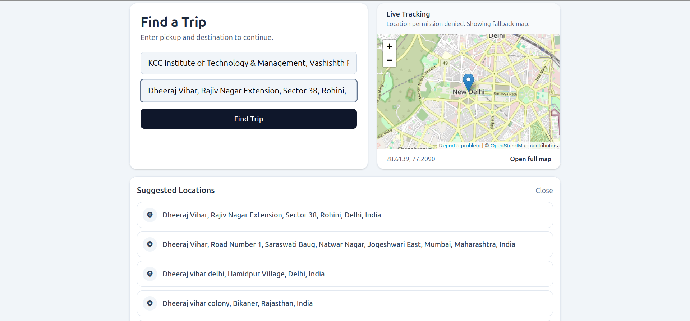

<p align="center">
  <a href="https://traveller-7rpg.onrender.com/">hello</a>
</p>

<p align="center">
  
</p>

<h1 align="center">🚗 Traveller</h1>

<p align="center">
  <b>A full-stack ride-hailing platform built with React, Node.js, Express & MongoDB</b>
</p>

<p align="center">
  
  
  
  
  
</p>

---

## 📖 What is Traveller?

**Traveller** is a full-featured ride-hailing web application — think Uber, but built from scratch. It connects **riders** looking for a trip with **captains** (drivers) who can accept and fulfill those rides in real time.

The platform handles the complete lifecycle of a ride:

> **Rider searches → selects vehicle → confirms booking → captain accepts → OTP verification → trip starts → trip ends → payment**

Key highlights:

- ✅ **Dual authentication** — separate flows for users and captains
- ✅ **Live location tracking** using OpenStreetMap + browser Geolocation API
- ✅ **Fare estimation** powered by Google Maps Distance Matrix API
- ✅ **Location autocomplete** powered by Google Maps Places API
- ✅ **OTP-based ride verification** to ensure rider-captain match
- ✅ **Real-time communication** infrastructure via Socket.IO
- ✅ **Protected routes** on both frontend and backend

---

## 🔄 How Users & Captains Work Together

The interaction between a **user (rider)** and a **captain (driver)** follows a structured flow:

```
┌──────────────────────────────────────────────────────────────────────┐
│                         RIDER SIDE                                  │
│                                                                      │
│  1. Rider enters pickup & destination                                │
│  2. App fetches fare estimate from Google Maps API                   │
│  3. Rider selects vehicle type (Car / Moto / Auto)                   │
│  4. Rider confirms booking → ride is created (status: pending)       │
│  5. Rider receives OTP for the ride                                  │
│  6. Rider shares OTP with captain to start the trip                  │
│  7. Rider tracks trip on live map                                    │
│  8. Ride ends → rider makes payment                                  │
└──────────────────────────────────────────────────────────────────────┘

                        ↕  Socket.IO  ↕

┌──────────────────────────────────────────────────────────────────────┐
│                        CAPTAIN SIDE                                  │
│                                                                      │
│  1. Captain goes online → sees dashboard with stats                  │
│  2. Captain receives incoming ride notification                      │
│  3. Captain accepts the ride (status: accepted)                      │
│  4. Captain enters OTP from rider to verify                          │
│  5. Trip starts (status: ongoing) → captain navigates to destination │
│  6. Captain hits "Complete Ride" → ride ends (status: completed)     │
│  7. Earnings update on captain dashboard                             │
└──────────────────────────────────────────────────────────────────────┘
```

### Ride Status Lifecycle

| Status | Description |
|:--|:--|
| `pending` | Ride created, waiting for a captain to accept |
| `accepted` | A captain accepted the ride |
| `ongoing` | OTP verified, trip is in progress |
| `completed` | Captain ended the trip |
| `cancelled` | Either party cancelled |

---

## ⚡ Socket.IO — Real-Time Communication

The backend includes **Socket.IO v4.8** for real-time, bidirectional communication between users and captains. Here's how it's architected:

### How it works

```
  Rider App                   Server                    Captain App
     │                          │                          │
     │ ── connect ──────────►   │                          │
     │                          │   ◄─── connect ──────── │
     │                          │                          │
     │ ── create-ride ────►     │                          │
     │                          │ ── new-ride ──────────► │
     │                          │                          │
     │                          │   ◄── accept-ride ───── │
     │ ◄── ride-confirmed ──    │                          │
     │                          │                          │
     │ ── start-ride (OTP) ►    │                          │
     │                          │ ── ride-started ──────► │
     │                          │                          │
     │                          │   ◄── end-ride ──────── │
     │ ◄── ride-ended ────────  │                          │
```

### Key Details

| Feature | Implementation |
|:--|:--|
| **Connection** | Both User and Captain models store a `socketId` field, updated on connect |
| **Ride notifications** | When a ride is created, nearby captains are found using MongoDB's `$geoWithin` + `$centerSphere` query and notified via their socket |
| **Status updates** | Ride status changes (`accepted`, `ongoing`, `completed`) are broadcast in real time to both parties |
| **Scalability** | Socket.IO supports rooms and namespaces — easily extensible for multi-city deployments |

> **Note:** The current frontend uses a mock-safe flow for ride assignment (demo button). The Socket.IO server infrastructure is installed and the models are wired up — plug in `socket.io-client` on the frontend to go fully live.

---

## 🚀 How to Use It

### As a Rider

1. **Sign up** at `/signup` with your name, email, and password
2. **Log in** at `/login`
3. **Enter pickup & destination** on the home page
4. Click **"Find Trip"** — the app fetches fare estimates
5. **Select a vehicle** (Car, Moto, or Auto) and confirm
6. **Share the OTP** with your captain when they arrive
7. Track your ride on the **live map**

### As a Captain

1. **Register** at `/captain-signup` with personal + vehicle details
2. **Log in** at `/captain-login`
3. View your **dashboard** — earnings, trips, hours, and rating
4. **Accept incoming rides** from the ride panel
5. **Enter the rider's OTP** to verify and start the trip
6. Navigate and click **"Complete Ride"** when done

---

## 🗂 API Reference

The backend exposes 4 route groups. All ride/map endpoints require JWT authentication.

### 👤 User Routes — `/users`

| Method | Endpoint | Auth | Description |
|:--|:--|:--|:--|
| `POST` | `/users/register` | ✗ | Register a new user |
| `POST` | `/users/login` | ✗ | Login and receive JWT |
| `GET` | `/users/profile` | ✔ User | Get current user profile |
| `GET` | `/users/logout` | ✔ User | Logout and blacklist token |

### 🚘 Captain Routes — `/captains`

| Method | Endpoint | Auth | Description |
|:--|:--|:--|:--|
| `POST` | `/captains/register` | ✗ | Register with vehicle details |
| `POST` | `/captains/login` | ✗ | Login and receive JWT |
| `GET` | `/captains/profile` | ✔ Captain | Get captain profile |
| `POST` | `/captains/logout` | ✔ Captain | Logout and blacklist token |

### 🗺 Map Routes — `/maps`

| Method | Endpoint | Auth | Description |
|:--|:--|:--|:--|
| `GET` | `/maps/get-coordinates?address=` | ✔ User | Geocode an address → lat/lng |
| `GET` | `/maps/get-distance-time?origin=&destination=` | ✔ User | Distance & duration between two places |
| `GET` | `/maps/get-suggestions?input=` | ✔ User | Place autocomplete suggestions |

### 🛣 Ride Routes — `/rides`

| Method | Endpoint | Auth | Description |
|:--|:--|:--|:--|
| `POST` | `/rides/create` | ✔ User | Create a ride (pickup, destination, vehicleType) |
| `GET` | `/rides/get-fare?pickup=&destination=` | ✔ User | Get fare estimate for vehicle types |
| `POST` | `/rides/confirm-ride` | ✔ Captain | Captain confirms/accepts a ride |
| `POST` | `/rides/start-ride` | ✔ User | Start ride with OTP verification |
| `POST` | `/rides/end-ride` | ✔ Captain | End an ongoing ride |

---

## 🛠 Setup & Installation

### Prerequisites

- **Node.js** ≥ 20.19.0
- **MongoDB** (Atlas cloud or local instance)
- **Google Maps API Key** (for geocoding, distance matrix, and places)

### 1. Clone the repository

```bash
git clone https://github.com/your-username/traveller.git
cd traveller
```

### 2. Backend setup

```bash
cd backend
npm install
```

Create a `.env` file in the `backend/` directory:

```env
PORT=5000
MONGODB_URI=mongodb+srv://<user>:<password>@cluster.mongodb.net/<dbname>
JWT_SECRET=your_super_secret_key
GOOGLE_MAPS_API_KEY=your_google_maps_api_key
FRONTEND_URL=http://localhost:5173
```

Start the backend server:

```bash
npm run dev        # development (nodemon)
npm start          # production
```

### 3. Frontend setup

```bash
cd frontend
npm install
```

Start the React dev server:

```bash
npm run dev
```

The frontend will be available at `http://localhost:5173`.

### 4. Build for production

```bash
cd frontend
npm run build      # outputs to frontend/dist/
```

### 5. Run tests

```bash
cd backend
npm test           # runs Jest with in-memory MongoDB
npm run test:coverage
```

---

## 📂 Project Structure

```
traveller/
├── backend/
│   └── src/
│       ├── controllers/      # Route handlers (user, captain, ride, map)
│       ├── models/           # Mongoose schemas (User, Captain, Ride, BlacklistToken)
│       ├── routes/           # Express route definitions
│       ├── services/         # Business logic (maps, rides, users, captains)
│       ├── middlewares/      # Auth middleware (JWT verification)
│       ├── utils/            # ApiError, ApiResponse, asyncHandler
│       ├── db/               # MongoDB connection
│       ├── app.js            # Express app configuration
│       └── index.js          # Server entry point
├── frontend/
│   └── src/
│       ├── pages/            # Start, Login, Signup, Home, Riding, Captain pages
│       ├── components/       # VehiclePanel, LiveTracking, RidePopUp, etc.
│       ├── slices/           # Redux Toolkit slices (auth, ride)
│       ├── services/         # Axios API client, token storage
│       └── App.jsx           # React Router configuration
└── README.md
```

---

## 🧰 Tech Stack

| Layer | Technology |
|:--|:--|
| **Frontend** | React 19, Vite 7, Tailwind CSS 4, Redux Toolkit, React Router 7 |
| **Backend** | Node.js, Express 5, Mongoose 9, Socket.IO 4.8 |
| **Database** | MongoDB Atlas |
| **Maps** | Google Maps Geocoding, Distance Matrix & Places APIs |
| **Auth** | JWT (JSON Web Tokens), bcrypt password hashing |
| **Testing** | Jest, Supertest, mongodb-memory-server |

---

<p align="center">
  Built with ❤️ by <b>Traveller Team</b>
</p>
